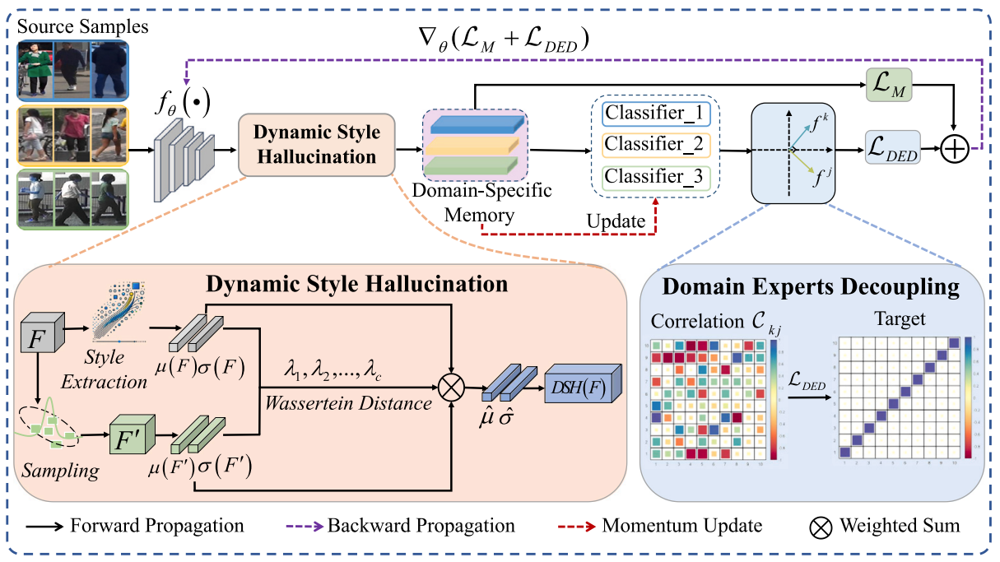
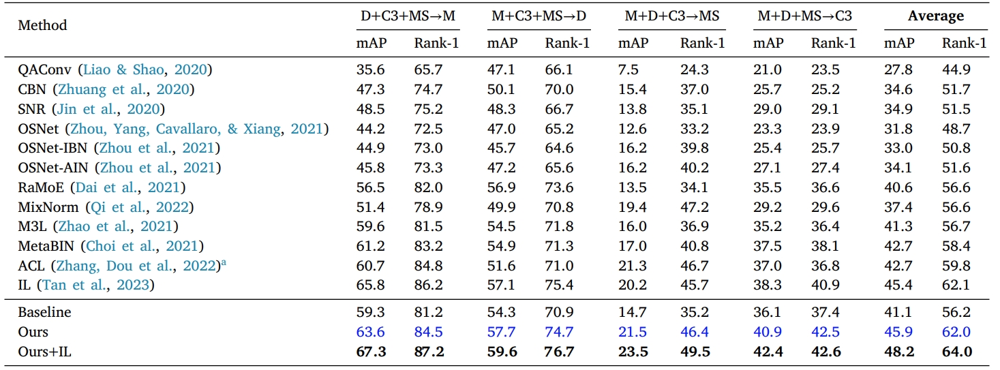
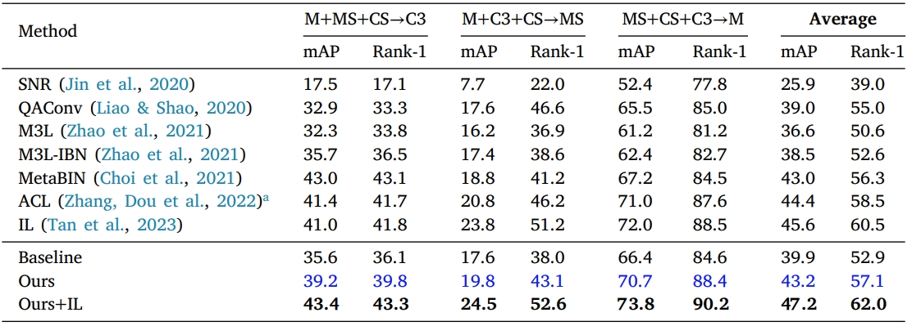
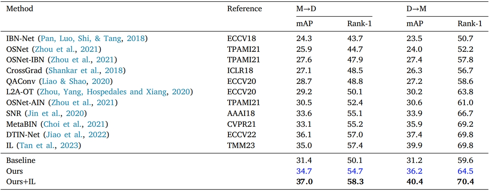
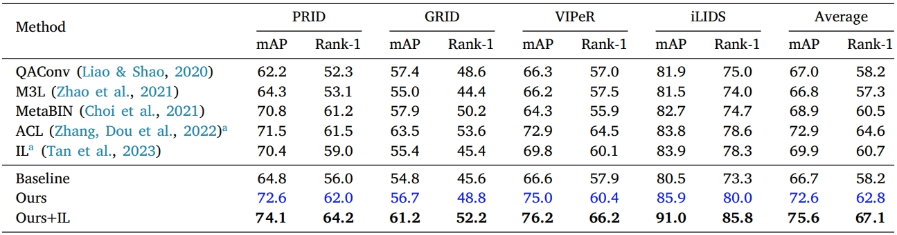
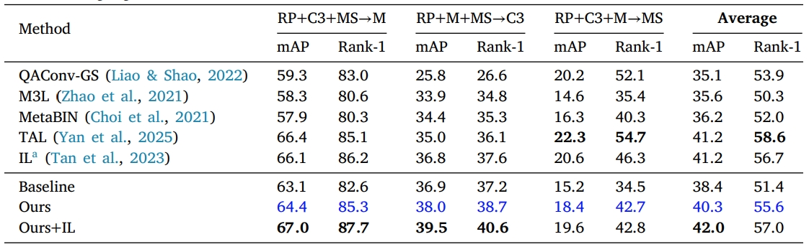

# [Neural Network 2025] DiverseReID: Towards generalizable person re-identification via Dynamic Style Hallucination and decoupled domain experts
## Framework

## Requirements
### Installation
we use /torch 1.13.1 /torchvision 0.14.1 /cuda 11.7 /four 24G RTX 4090 for running.
### Prepare Datasets
The model is run on Market-1501, DukeMTMC-reID, MSMT17_V1, CUHK03, CUHK-SYSU, CUHK02, VIPeR, PRID, GRID, iLIDS, RandPerson.</br>
Unzip all datasets and ensure the file structure is as follow:</br>
```
data
├── market1501
│    └── Market-1501-v15.09.15
│        └── images ..
├── dukemtmc
│    └── DukeMTMC-reID
│        └── images ..
├── msmt17v1
│    └── MSMT17_V1
│        └── images ..
├── cuhk03
│    └── cuhk03_release
│        └── images ..
└── cuhk_sysu
│    └── croppped_images
│        └── images ..
├── cuhk02
│    └── images ..
├── viper
│    └── images ..
├── prid_2011
│    └── images ..
├── GRID
│    └── images ..
├── QMUL-iLIDS
│    └── images ..
├── randperson_subset
│    └── randperson_subset ..

```
## Run
```
ARCH=resnet50

Three-source domains(Protocol-1 or Protocol-2 or Protocol-5)
SRC1/SRC2/SRC3=market1501/dukemtmc/cuhk03/msmt17v1/cuhk_sysu/rand
TARGET=market1501/dukemtmc/cuhk03/msmt17v1

Single-source domain(Protocol-3)
SRC1=market1501/dukemtmc
TARGET=dukemtmc/market1501

Four-source domains(Protocol-4)
SRC1/SRC2/SRC3/SRC4=market1501/cuhk02/cuhk03/cuhk_sysu
TARGET=prid/grid/viper/ilids

# train baseline
CUDA_VISIBLE_DEVICES=0,1,2,3 python main.py \
-a resnet50 -b 64 --test-batch-size 256 --iters 200 --lr 3.5e-4 --epoch 70 \
--dataset_src1 dukemtmc --dataset_src2 cuhk03 --dataset_src3 msmt17v1 -d market1501 \
--data-dir DATA_PATH \
--logs-dir logs/Baseline

# train DiverseReID
CUDA_VISIBLE_DEVICES=0,1,2,3 python main.py \
-a resnet50 -b 64 --test-batch-size 256 --iters 200 --lr 3.5e-4 --epoch 70 \
--dataset_src1 dukemtmc --dataset_src2 cuhk03 --dataset_src3 msmt17v1 -d market1501 \
--data-dir DATA_PATH \
--logs-dir logs/DiverseReID \
--updateStyle

```
*Note:*</br>
(1) Just simply set '--updateStyle' can activate the DiverseReID.</br>
(2) In single-source domain running, only dataset_src1 is retained.

## Results
### Protocol-1</br>

### Protocol-2</br>

### Protocol-3</br>

### Protocol-4</br>

### Protocol-5</br>

## Acknowledgements
Our implementation is based on [IL](https://github.com/WentaoTan/Interleaved-Learning); we gratefully thank the author for their wonderful work.
## Citation
```
@article{jia2025diversereid,
  title={DiverseReID: Towards generalizable person re-identification via Dynamic Style Hallucination and decoupled domain experts},
  author={Jia, Jieru and Xie, Huidi and Huang, Qin and Song, Yantao and Wu, Peng},
  journal={Neural Networks},
  pages={107602},
  year={2025},
  publisher={Elsevier}
}
```
## Contact
If you have any question, please feel free to contact us.</br>
E-mail: [jierujia@sxu.edu.cn](mailto:jierujia@sxu.edu.cn) or [202322405008@email.sxu.edu.cn](mailto:202322405008@email.sxu.edu.cn)
